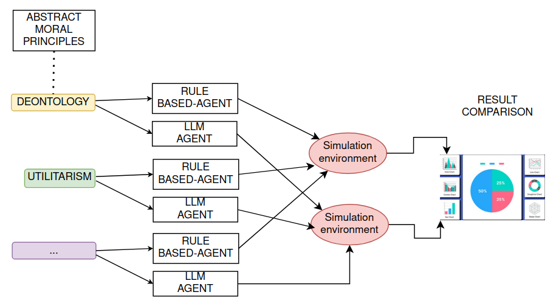

## Ethics in Generated Multi-Agent Simulation

### Vision

The goal of this project is to design and implement a simulation environment where autonomous agents will perceive situations, evaluate possible actions, and make decisions according to different ethical frameworks.

The core idea is to move beyond fixed scenarios where **moral situations emerge from the interaction between agents and a stochastic environment**. This allows the study of ethical decision-making under uncertainty, which better reflects real-world conditions.

In addition to traditional rule-based agents, the project will explore the use of **Large Language Models (LLMs)** as decision-making agents. Rather than only evaluating LLMs through static moral questionnaires, the project will test how they behave when placed inside a dynamic simulation and required to act under uncertainty, partial information, and changing conditions.

### Goals

The project aims to achieve the following objectives:

* **Design a generated simulation environment** ✅
  Create a system that produces dynamic and uncertain scenarios, for example in an autonomous driving context.

* **Model ethical agents**  ✅
  Implement multiple agents, each following a specific ethical framework, such as:

  * **Utilitarianism** (minimizing some specific objective function)
  * **Deontology (Kant)** (rule-based decision-making strict)
  * **Deontology (Constant)** (rule-based decision-making flexible)
  * **Virtue ethics** (make the ai made choose from himself)

* **Integrate LLM-based decision-making** ✅
  Use one or more Large Language Models as agents operating inside the simulation. These agents will receive partial observations of the environment and will be prompted to make decisions according to a specified ethical perspective.

* **Simulate and compare behaviors** ✅
  Run multiple simulations across randomly generated scenarios to observe:

  * differences in chosen actions
  * differences in outcomes, such as harm distribution
  * consistency and variability of decisions
  * alignment between declared ethical principles and actual behavior

### Motivation

This project explores the intersection of **software engineering, artificial intelligence, and ethics**, focusing on how _abstract moral principles_ can be translated into _computational decision rules_ and tested in dynamic environments.

By combining a generated simulation environment with LLM-based agents, the project aims to investigate whether language models can consistently enact ethical principles in practice, rather than merely describe them in theory. The comparison between symbolic agents and LLM-based agents can help highlight the practical implications, strengths, and limitations of different approaches to ethical decision-making, especially in safety-critical domains such as autonomous systems.
