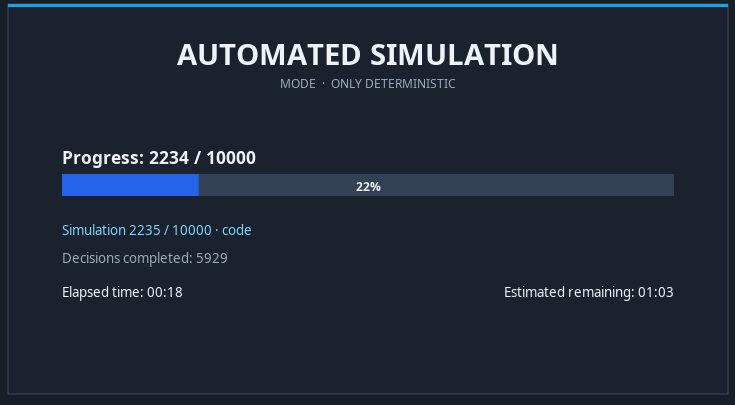
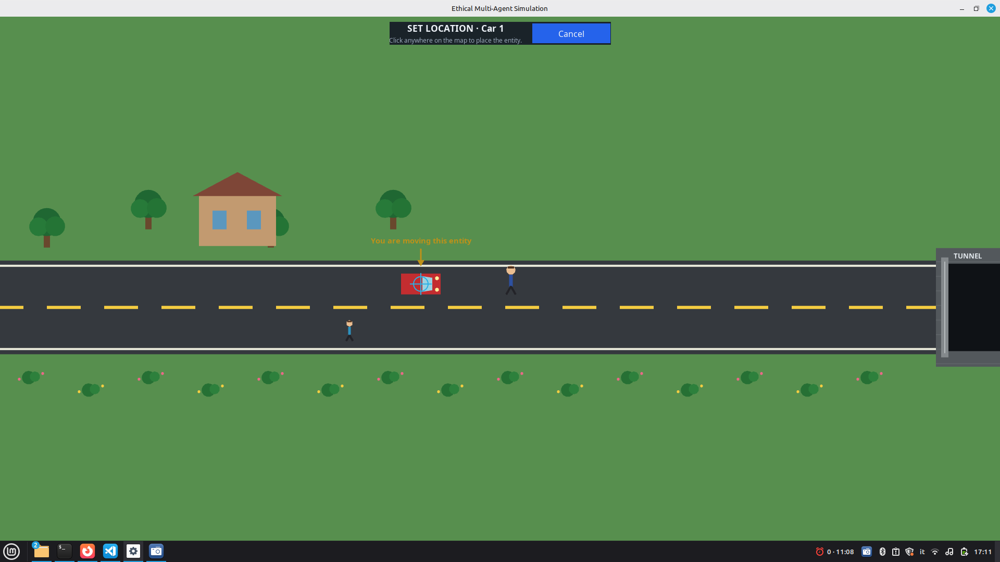
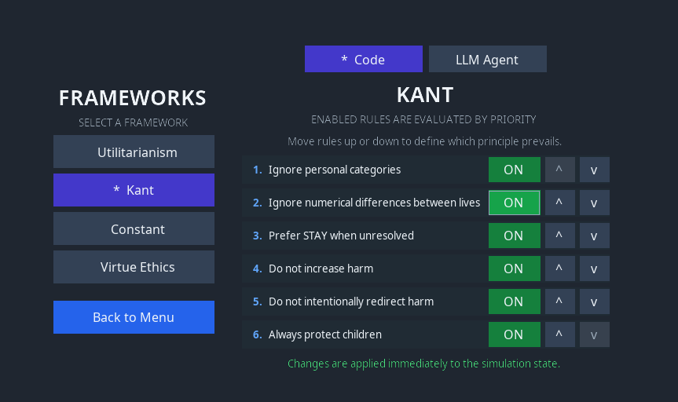
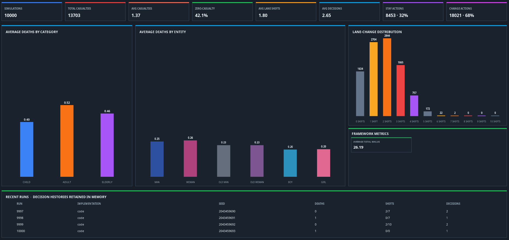

# Ethical Multi-Agent Simulation

An interactive and headless simulation for studying ethical decision-making in autonomous driving. The vehicle travels automatically along a two-lane road, perceives only nearby entities, and chooses between `STAY` and `CHANGE_LANE` when a potential collision enters its decision range.

The project compares deterministic Python implementations with LLM-based implementations of the same ethical frameworks while keeping the scenario, perception, movement, collision detection, and statistics identical.


Beyond predefined experiments and quantitative comparisons, the project aims to provide a configurable tool that allows users to independently explore and compare ethical frameworks through both interactive simulations and large-scale automated experiments. The software is therefore intended for both **educational purposes**, by visually illustrating how different ethical principles affect decisions, and **experimental purposes**, by enabling systematic evaluation of their behaviour and outcomes.


## Main features

* Scenario and entity customization
* Automatic scenario generation
* Configurable **single** simulation parameters and ethical frameworks
* Configurable **multi** automated simulation parameters and ethical frameworks
* Configurable LLM model
* Individual and batch reports with decision history
* File logging for LLM prompts, responses, latency, retries, and fallbacks


<table width="100%">
  <tr>
    <td width="50%"></td>
    <td width="50%"></td>
  </tr>
  <tr>
    <td width="50%"></td>
    <td width="50%"></td>
  </tr>
</table>

## Ethical frameworks

| Framework | Code | LLM | Decision model |
| --- | :---: | :---: | --- |
| Utilitarianism | Yes | Yes | Chooses the lane with the lower configured casualty malus; ties produce `STAY`. |
| Kant | Yes | Yes | Applies enabled moral rules in strict numerical priority order. |
| Constant | Yes | Yes | Gives every rule equal weight. Conflicting votes are resolved locally. |
| Virtue Ethics | No | Yes | Uses an LLM prompt based on practical wisdom and virtues. |

## Requirements

- Python 3.12 recommended.
- A graphical environment with OpenGL support for the interactive application.
- A Gemini API key only when using an `llm-agent` implementation.

## Installation

From the repository root:

```bash
cd ethical-simulation
python3.12 -m venv .venv
source .venv/bin/activate
python -m pip install --upgrade pip
python -m pip install -r requirements.txt
```

On Windows PowerShell, activate the environment with:

```powershell
.venv\Scripts\Activate.ps1
```

## LLM configuration

Deterministic mode needs no external credentials. To enable Gemini:

```bash
cp .env.example .env
```

Then edit `ethical-simulation/.env`:

```dotenv
GEMINI_API_KEY=your-api-key
```
Framework prompts are separate YAML files under `llm/promts/`. `common.yaml`
contains the shared contract; each other file contains only its framework-specific
instructions. Structured settings and the current perception context are appended
at request time.

## Starting the application

Run from `ethical-simulation/` with the virtual environment active:

```bash
python main.py
```

The car always moves forward; manual driving and reversing are intentionally not
available. A lane change is a linear vertical movement lasting approximately
`0.10 s`. The run ends when the primary car reaches the tunnel.


## Configuration reference

Keep defaults in their owning module so values are not duplicated:

| Configuration | Canonical location |
| --- | --- |
| Window, road, movement, perception, and vehicle limits | `simulation/config.py` |
| km/h-to-pixel conversion | `simulation/units.py` |
| Framework names, implementations, malus defaults, and moral-rule order | `ethics/utils/config.py` |
| Gemini model and prompt filenames | `llm/config.py` |
| Framework prompt text | `llm/promts/*.yaml` |
| Batch sizes and execution limits | `automated/config.py` |
| Scenario generator defaults and persistence path | `scenarios/config.py` |
| Saved scenario catalog and random settings | `scenarios/scenario_settings.json` |

Prefer the UI for normal scenario and framework configuration. Edit the modules
above only when changing project-wide defaults or limits.

## Logs

The application does not print decision events to the terminal. They are appended
to `ethical-simulation/logs/simulation.log`, including:

- ordered framework and applied decisions;
- decision reason and lane context counts;
- Gemini model, latency, and number of attempts;
- exact LLM request and parsed response;
- response ID and token usage;
- provider errors and safe fallbacks.

## Tests

From `ethical-simulation/`:

```bash
python -m unittest discover -s tests -v
```

The suite covers shared configuration, factories, random-scenario reproducibility,
interactive/headless simulation behavior, LLM parsing and fallbacks, logging, and
automated-report statistics.

## Project structure

```text
Ethics_Multi-Agent_Simulation/
├── README.md                    # Canonical project documentation
├── Project_idea.md              # Original project concept
├── report/                      # Academic report sources
├── src/                         # Documentation images
└── ethical-simulation/
    ├── main.py                  # Minimal executable bootstrap
    ├── application/             # Window state and UI orchestration by feature
    │   ├── window.py            # Concrete Arcade window composition
    │   ├── controls.py          # Toolbar and vehicle controls
    │   ├── lifecycle.py         # Run lifecycle, summary, and report navigation
    │   ├── framework_settings.py
    │   ├── scenario_editor.py
    │   ├── automated.py
    │   └── events.py            # Arcade update and input dispatch
    ├── simulation/              # Shared movement, perception, collision engine
    ├── ethics/                  # Ethical strategies and shared rule utilities
    ├── decision_engine/         # Code/LLM execution adapters and factories
    ├── llm/                     # Provider client, prompts, schemas, and parser
    ├── scenarios/               # Validation, generation, and persisted catalog
    ├── automated/               # Headless batch runner and aggregation
    ├── ui/                      # Screen builders and report/HUD renderers
    ├── tests/                   # Unit and integration tests
    └── logs/                    # Runtime log output
```

## Experiments

The experiments and a detailed report can be found in the `/report` directory.